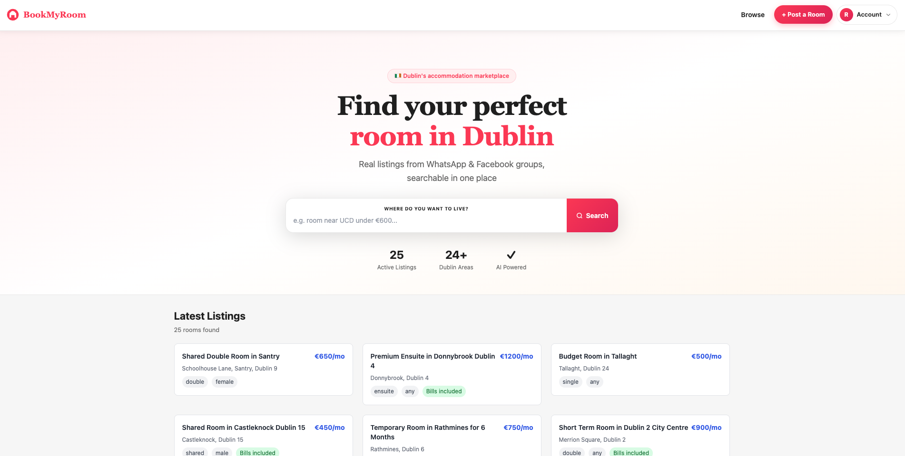
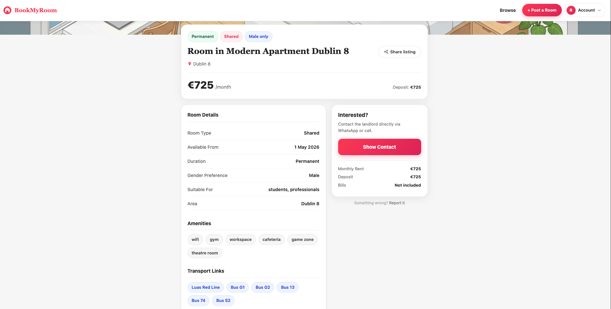
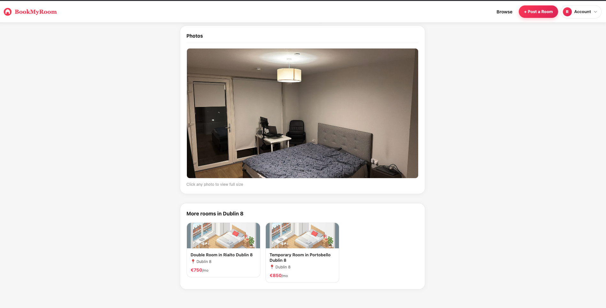
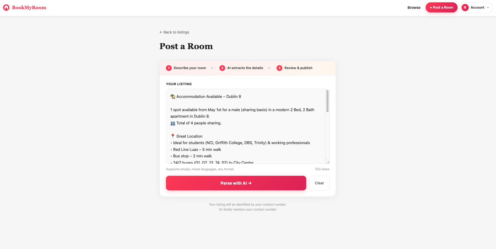
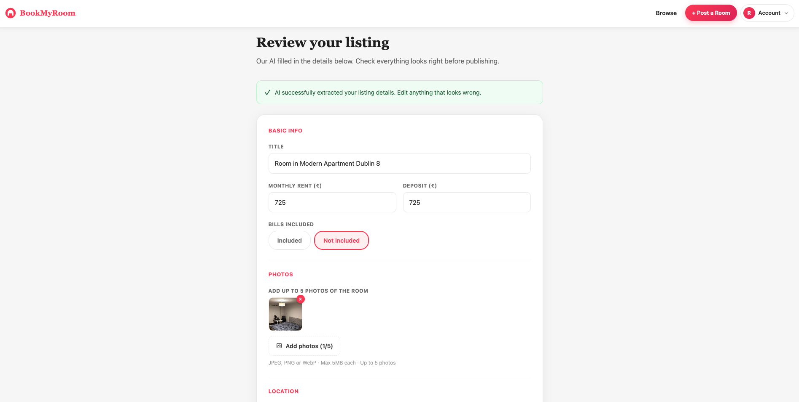
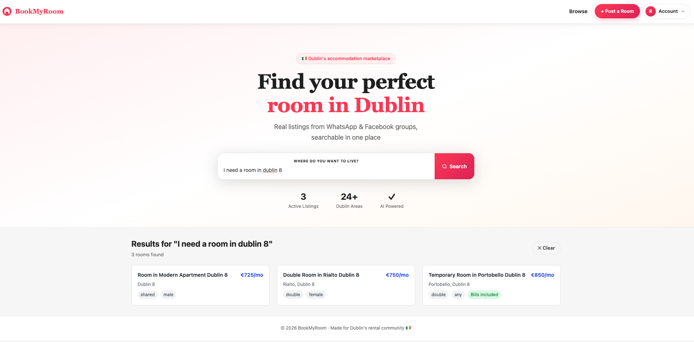
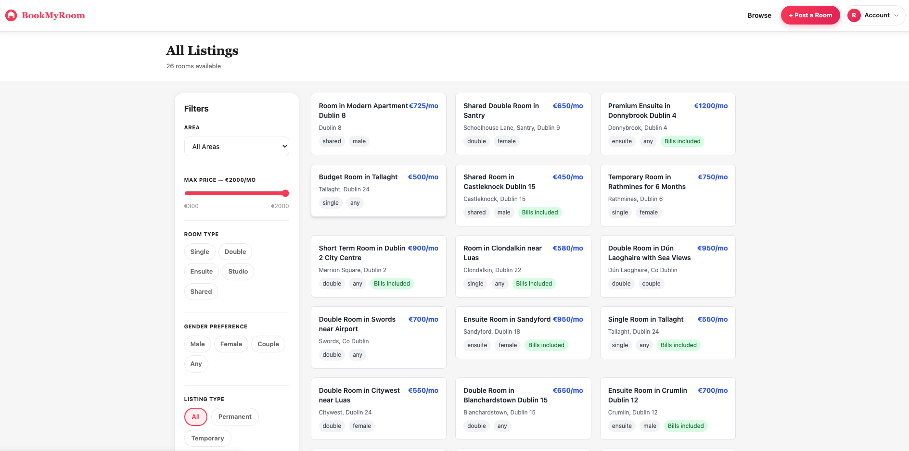
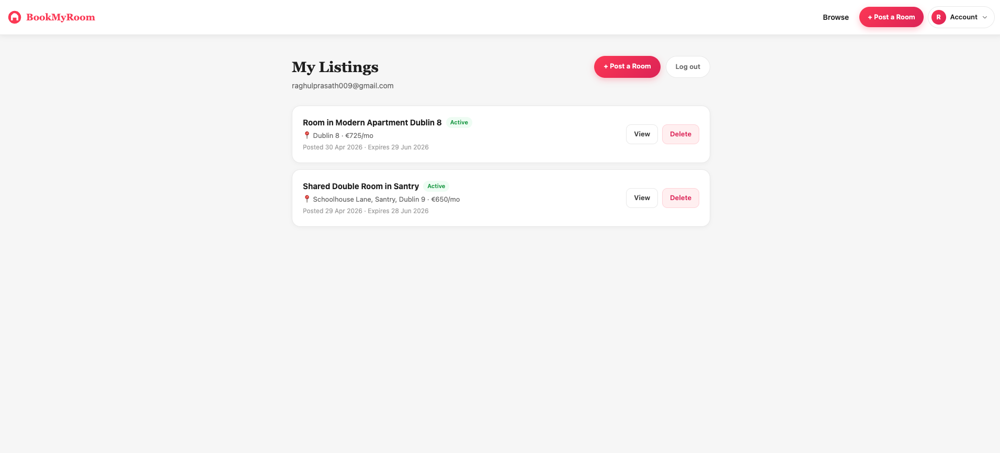
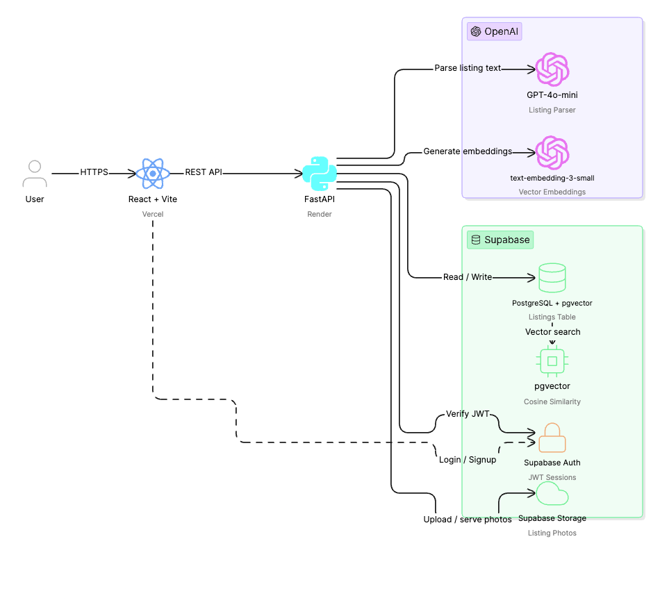

# BookMyRoom 🏠

### AI powered Dublin accommodation marketplace

**Turn messy WhatsApp listings into a searchable platform in seconds.**

[**Live Demo →**](https://book-my-room-psi.vercel.app) &nbsp;·&nbsp;
[**API Docs →**](https://bookmyroom-api-3sb1.onrender.com/docs) &nbsp;·&nbsp;
[**Report Bug**](https://github.com/RaghulPrasath-Here/BookMyRoom/issues)

---

## The Problem

Dublin's rental market is broken. Thousands of rooms are listed every day but not on Daft.ie. They live in WhatsApp groups, Facebook communities, and Telegram channels as unstructured messages that disappear in minutes.

Renters manually scroll through hundreds of these messages every day. Landlords post the same message across 10 groups hoping someone sees it. There is no structure, no searchability, no platform.

**BookMyRoom solves this.**

---

## What It Does

| For Posters | For Searchers |
|---|---|
| Paste your WhatsApp message as-is | Search in plain English |
| AI extracts all fields automatically | "temp room near UCD for female under €600" |
| Review, edit, and publish in seconds | Results ranked by semantic relevance |
| Upload up to 5 photos | Filter by area, price, gender, type |
| Manage listings from your account | Contact landlord directly via WhatsApp |

---

## Screenshots

### Home Page

*Natural language search with AI-powered results*

### Listing Detail


*Full listing view with photos, transport links, nearby places and contact. Also with similar listings.*

### Submit a Listing

*Paste any WhatsApp-style message, our AI does the rest*

### Confirm & Publish

*Review and edit AI extracted fields before publishing*

### Semantic search result

*User search query and the listings closely related to it given as response*

### Browse with Filters

*Filter by area, price, room type, gender preference*

### My Listings

*Manage your active listings with one click delete*

---

## Architecture



---

### Data Flow

```
LISTING SUBMISSION
──────────────────
Paste raw text → POST /listings/parse
    → GPT-4o-mini extracts fields + reasons Dublin geography
    → User reviews on Confirm page
    → Photos uploaded to Supabase Storage
    → POST /listings/ with auth token
    → text-embedding-3-small generates 1536-dim vector
    → Listing + embedding saved to Supabase

NATURAL LANGUAGE SEARCH
────────────────────────
User types query → POST /search/
    → text-embedding-3-small embeds the query
    → GPT-4o-mini reasons about Dublin geography
      ("near Guinness Storehouse" → Dublin 8, Luas Red Line, St James Hospital)
    → pgvector cosine similarity search (threshold: 0.3–0.4)
    → Hard filters applied (area, price, gender, permanent/temp)
    → Suburb exclusion if city centre requested
    → Exact area match boosting
    → Top 10 results returned
```

---

## Tech Stack

| Layer | Technology | Purpose |
|---|---|---|
| **Frontend** | React 18 + Vite | Single page application |
| **Routing** | React Router v6 | Client-side navigation |
| **Backend** | FastAPI (Python 3.11) | REST API |
| **Database** | PostgreSQL via Supabase | Data persistence |
| **Vector Search** | pgvector extension | Semantic similarity search |
| **AI — Parsing** | OpenAI GPT-4o-mini | Structured data extraction + geographic reasoning |
| **AI — Embeddings** | text-embedding-3-small | 1536-dimensional semantic vectors |
| **Auth** | Supabase Auth | JWT-based email/password auth |
| **Storage** | Supabase Storage | Listing photo uploads |
| **Rate Limiting** | SlowAPI | Per-IP request limiting |
| **Frontend Deploy** | Vercel | CDN hosting + auto-deploy |
| **Backend Deploy** | Render | Web service hosting + auto-deploy |

---

## Key Features

### 🤖 AI-Powered Parsing
Paste any WhatsApp or Facebook listing message with emojis, mixed languages, informal abbreviations and GPT-4o-mini extracts every structured field. It also **reasons about Dublin geography**: mention "Guinness Storehouse" and the parser fills in `dublin_area: Dublin 8`, adds Luas Red Line, Bus 13, 40, St James Hospital — even if none of those were in the original message.

### 🔍 Semantic Natural Language Search
Search works the way you think, not the way a database works. Type "temp room near UCD for female under €600" and the system:
- Embeds your query into a 1536-dimensional vector
- Runs cosine similarity against all listing embeddings
- Extracts hard filters (area, price, gender) via GPT reasoning
- Resolves synonyms ("city centre" → Dublin 1, Dublin 2)
- Excludes irrelevant suburbs when you ask for city centre
- Boosts exact area matches

### 📍 Dublin Geography Intelligence
The system has built in knowledge of Dublin:
- 30+ area synonyms ("city centre" → Dublin 1/2, "southside" → D4/D6/Rathmines)
- Landmark to area resolution ("near Croke Park" → Dublin 3/9)
- Suburb exclusion list for city centre searches
- Transport aware matching (Luas lines, DART, bus routes)

### 🔐 Full Auth System
Email/password authentication via Supabase Auth. JWT tokens secure all write operations. Row Level Security on the database. Owners can only edit/delete their own listings.

### 📸 Photo Upload
Upload up to 5 photos per listing (JPEG/PNG/WebP, 5MB max). Photos stored in Supabase Storage under `{user_id}/{uuid}.ext`. 

### ⏱️ Listing Expiry
Listings automatically expire after 60 days. A Postgres `pg_cron` job runs nightly to deactivate expired listings. All queries filter by `expires_at > now()`.

### 🚦 Rate Limiting
Per-IP rate limits protect OpenAI API costs:
- `POST /listings/parse` → 10/minute
- `POST /listings/` → 20/minute
- `POST /search/` → 30/minute

---

## Project Structure

```
bookmyroom/
├── backend/
│   ├── app/
│   │   ├── main.py              # FastAPI app entry point
│   │   ├── config.py            # Supabase clients (anon + admin)
│   │   ├── auth.py              # JWT middleware
│   │   ├── limiter.py           # SlowAPI rate limiter
│   │   ├── models.py            # Pydantic models
│   │   ├── routers/
│   │   │   ├── listings.py      # CRUD + parse endpoints
│   │   │   ├── search.py        # Natural language search
│   │   │   ├── auth.py          # Signup / login / logout
│   │   │   └── photos.py        # Photo upload / delete
│   │   └── services/
│   │       ├── parser.py        # GPT-4o-mini listing parser
│   │       ├── embeddings.py    # Vector embedding generation
│   │       └── search.py        # Full search pipeline
│   ├── requirements.txt
│   └── runtime.txt
│
├── frontend/
│   └── src/
│       ├── context/
│       │   └── AuthContext.jsx  # Global auth state
│       ├── components/
│       │   ├── Navbar.jsx       # Auth-aware navigation
│       │   ├── SearchBar.jsx    # Natural language input
│       │   ├── ListingCard.jsx  # Listing preview card
│       │   ├── Badge.jsx        # Reusable pill badge
│       │   └── SkeletonCard.jsx # Loading placeholder
│       └── pages/
│           ├── Home.jsx         # Hero + search + listings
│           ├── Browse.jsx       # Filtered listings grid
│           ├── Submit.jsx       # Paste & parse listing
│           ├── Confirm.jsx      # Review + photo upload
│           ├── ListingDetail.jsx # Full listing + similar
│           ├── Login.jsx        # Email login
│           ├── Signup.jsx       # Account creation
│           ├── MyListings.jsx   # Manage own listings
│           └── Success.jsx      # Post-publish share
│
└── render.yaml                  # Render deploy config
```

---

## Getting Started

### Prerequisites
- Node.js 18+
- Python 3.11+
- Supabase account (free tier)
- OpenAI API key

### 1. Clone

```bash
git clone https://github.com/RaghulPrasath-Here/BookMyRoom.git
cd BookMyRoom
```

### 2. Backend

```bash
cd backend
python3 -m venv venv
source venv/bin/activate
pip install -r requirements.txt
```

Create `backend/.env`:

```env
SUPABASE_URL=https://your-project.supabase.co
SUPABASE_KEY=anon-key
SUPABASE_SERVICE_KEY=service-role-key
OPENAI_API_KEY=your-key
```

```bash
uvicorn app.main:app --reload
# API running at http://localhost:8000
# Swagger UI at http://localhost:8000/docs
```

### 3. Frontend

```bash
cd frontend
npm install
```

Create `frontend/.env`:

```env
VITE_SUPABASE_URL=https://your-project.supabase.co
VITE_SUPABASE_ANON_KEY=anon-key
```

```bash
npm run dev
# App running at http://localhost:5173
```

---

## Environment Variables

| Variable | Where | Description |
|---|---|---|
| `SUPABASE_URL` | backend | Supabase project URL |
| `SUPABASE_KEY` | backend | Supabase anon key |
| `SUPABASE_SERVICE_KEY` | backend | Service role key (bypasses RLS) |
| `OPENAI_API_KEY` | backend | OpenAI API key |
| `VITE_SUPABASE_URL` | frontend | Supabase URL for browser client |
| `VITE_SUPABASE_ANON_KEY` | frontend | Supabase anon key for browser client |

---

## API Reference

| Method | Endpoint | Auth | Description |
|---|---|---|---|
| `POST` | `/listings/parse` | No | Parse raw WhatsApp text with AI |
| `POST` | `/listings/` | Yes | Create a new listing |
| `GET` | `/listings/` | No | Get all active listings |
| `GET` | `/listings/my` | Yes | Get current user's listings |
| `GET` | `/listings/:id` | No | Get single listing |
| `PUT` | `/listings/:id` | Yes | Update listing (owner only) |
| `DELETE` | `/listings/:id` | Yes | Soft delete (owner only) |
| `POST` | `/search/` | No | Natural language search |
| `POST` | `/auth/signup` | No | Create account |
| `POST` | `/auth/login` | No | Login, returns JWT |
| `POST` | `/auth/logout` | No | Logout |
| `POST` | `/photos/upload` | Yes | Upload listing photo |
| `DELETE` | `/photos/delete` | Yes | Delete listing photo |
| `GET` | `/health` | No | Health check |

Full interactive docs: [bookmyroom-api-3sb1.onrender.com/docs](https://bookmyroom-api-3sb1.onrender.com/docs)

---

## Deployment

### Frontend — Vercel
- Auto-deploys on every push to `main`
- `frontend/public/vercel.json` handles SPA routing
- Environment variables set in Vercel dashboard

### Backend — Render
- Auto-deploys on every push to `main`
- Config in `render.yaml`
- Environment variables set in Render dashboard
- Free tier note: spins down after 15min inactivity; health ping on page load mitigates this

---

## Built With

This project was built as a portfolio project demonstrating full stack AI integration from schema design and vector search to responsive UI and production deployment.

**Stack highlights:**
- GPT-4o-mini for structured data extraction and geographic reasoning
- pgvector for production grade semantic search
- Supabase for auth + database + storage in one platform
- FastAPI for async Python REST API
- React with inline styles for zero-dependency UI

---

Made with ❤️ for Dublin's rental community 🇮🇪

**[bookmyroom.ie](https://book-my-room-psi.vercel.app)** &nbsp;·&nbsp; Built by [Raghul Prasath](https://github.com/RaghulPrasath-Here)

